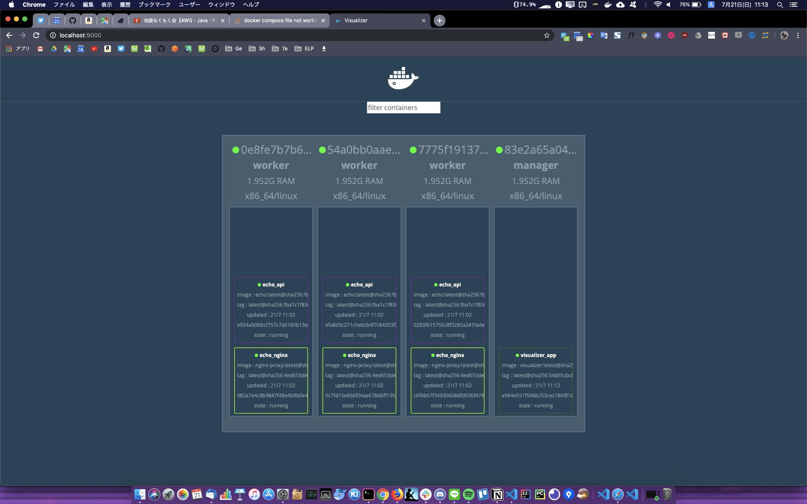

# 実用的なコンテナの構築とデプロイ

## アプリケーションとコンテナの粒度

「1コンテナ＝1プロセス」では複雑なパターンに対応することができない。コンテナは1つの関心事（ある1つの役割や問題領域）のみに集中すべき。

## Dockerフレンドリなアプリケーション

### 環境変数を活用する

アプリケーションの挙動を環境変数で制御する。または、Springの`application.properties`のように環境変数をアプリケーション内に埋め込むことも考える。

## 永続化データをどう扱うか

### Data Volume

Dockerコンテナ内のディレクトリをディスクに永続化するために仕組みであり、ホスト・コンテナ間でのディレクトリの共有・再利用が可能になる。

```bash
# ImageMagickに/workspace/gihyo.jpgという100x100の黒い画像ファイルを生成させる
# コンテナ内の/workspaceディレクトリは環境変数$PWDで表現されるディレクトリにマウントされる。
ocker container run -v {$PWD}:/workspace gihyodocker/imagemagick:latest convert -size 100x100 xc:#000000 /workspace/gihyo.jpg
```

Docker Volumeはコンテナ停止・破棄後も残る。

### Docker Volumeコンテナ

コンテナ間で直接ディレクトリを共有する。Data Volumeへの操作はカプセル化されるため、ホストをあまり意識せずにData Volumeを利用できる。

```Dockerfile
FROM busybox

VOLUME [ "/var/lib/mysql" ]

CMD [ "bin/true" ]
```

```bash
# volume用のイメージをビルド
docker image build -t example/mysql-data:latest .
# volume用のコンテナを起動
docker container run -d --name mysql-data example/mysql-data:latest

# volumeを指定してコンテナを起動
docker container run -d --rm --name mysql \
-e "MYSQL_ALLOW_EMPTY_PASSWORD=yes" \
-e "MYSQL_DATABASE=volume_test" \
-e "MYSQL_USER=example" \
-e "MYSQL_PASSWORD=example" \
--volumes-from mysql-data \
mysql:5.7
```

```bash
# 新たにbusyboxコンテナを実行し、Volumeに同じmysql-dataを指定する
# コンテナの中でtarコマンドでアーカイブを行い。出力先の/tmpディレクトリをカレントディレクトリにマウントする
docker container run -v {$PWD}:/tmp \
--volumes-from mysql-data \
busybox \
tar cvzf /tmp/mysql-backup.tar.gz /var/lib/mysql

# 別のホストにリストアする場合は、このアーカイブを展開してData Volumeコンテナを作成するだけでよい
```

## コンテナ配置戦略

### Docker Swarm

複数のDockerホストを束ねてクラスタ化するためのツール。

#### Docker in Dockerを利用してDocker Swarmクラスタを構築する

```bash
docker-compose up -d
Creating registry ... done
Creating manager  ... done
Creating worker03 ... done
Creating worker02 ... done
Creating worker01 ... done

# managerをSwarmのmanagerに設定する
docker container exec -it manager docker swarm init
Swarm initialized: current node (odfxuhm86xx0a5xy3il4d7m43) is now a manager.

To add a worker to this swarm, run the following command:

    docker swarm join --token SWMTKN-1-0zq39lgquyw4ifivvpb3ley7afxcqbxbusl9grh9nkcdjjph6q-d8r3rw828pqmvc66caal519x3 172.24.0.3:2377

To add a manager to this swarm, run 'docker swarm join-token manager' and follow the instructions.

# 表示されたjoinトークンを使用し、workerとして登録する
docker container exec -it worker01 docker swarm join \
--token SWMTKN-1-0zq39lgquyw4ifivvpb3ley7afxcqbxbusl9grh9nkcdjjph6q-d8r3rw828pqmvc66caal519x3 172.24.0.3:2377
This node joined a swarm as a worker.

# worker02, 03にも繰り返す
```

```bash
# ホスト側からregistryコンテナに対してDockerイメージをPushする
docker image tag example/echo:latest localhost:5000/example/echo:latest

# 指定のレジストリにコンテナをPushする
docker image push localhost:5000/example/echo:latest

The push refers to repository [localhost:5000/example/echo]
30dd1f577846: Pushed 
82842cbc6e21: Pushed 
186d94bd2c62: Pushed 
24a9d20e5bee: Pushed 
e7dc337030ba: Pushed 
920961b94eb3: Pushed 
fa0c3f992cbd: Pushed 
ce6466f43b11: Pushed 
719d45669b35: Pushed 
3b10514a95be: Pushed 
latest: digest: sha256:fba1c1f8364d26746bc5992b289bc543d2a5cea27b0030ac0fc413c3534dd8a4 size: 2417

# 指定のレジストリからdocker image pullする
# worker01コンテナ内にechoイメージをpull
docker container exec -it worker01 docker image pull registry:5000/example/echo:latest

# serviceをmanagerコンテナ内から作成する
docker container exec -it manager \                                       docker service create --replicas 1 --publish 8000:8080 --name echo registry:5000/example/echo:latest

b76qhqse1vmc7su8izsg9lng
overall progress: 1 out of 1 tasks 
1/1: running   [==================================================>] 
verify: Service converged

# serviceの一覧を確認する
docker exec -it manager docker service ls

ID                  NAME                MODE                REPLICAS            IMAGE                               PORTS
jb76qhqse1vm        echo                replicated          1/1                 registry:5000/example/echo:latest   *:8000->8080/tcp

# docker service scaleで該当Serviceのコンテナの数を増減させる
docker container exec -it manager docker service scale echo=6

echo scaled to 6
overall progress: 6 out of 6 tasks 
1/6: running   [==================================================>] 
2/6: running   [==================================================>] 
3/6: running   [==================================================>] 
4/6: running   [==================================================>] 
5/6: running   [==================================================>] 
6/6: running   [==================================================>]

# runningしているコンテナの確認
docker container exec -it manager docker service ps echo | grep Running

igocsj8c42uv        echo.1              registry:5000/example/echo:latest   83e2a65a044e        Running             Running 6 minutes ago                       
vidrs7jtl81n        echo.2              registry:5000/example/echo:latest   0e8fe7b7b636        Running             Running 2 minutes ago                       
yx55h7lfr08g        echo.3              registry:5000/example/echo:latest   7775f19137a7        Running             Running 2 minutes ago                       
ono45m1khhmo        echo.4              registry:5000/example/echo:latest   54a0bb0aae1d        Running             Running 2 minutes ago                       
tqe3s09ig99b        echo.5              registry:5000/example/echo:latest   54a0bb0aae1d        Running             Running 2 minutes ago                       
st9wob5ri88t        echo.6              registry:5000/example/echo:latest   83e2a65a044e        Running             Running 2 minutes ago

# デプロイしたserviceの削除
docker container exec -it manager docker service rm echo
```

### Stack

```bash
# overlayネットワークの作成
docker container exec -it manager docker network create --driver=overlay --attachable ch03

# stackをデプロイする
docker container exec -it manager docker stack deploy -c stack/ch03-webapi.yml echo

# stackにデプロイされているService一覧を表示する
docker container exec -it manager docker stack services echo
ID                  NAME                MODE                REPLICAS            IMAGE                               PORTS
mbmoa1aad9eq        echo_nginx          replicated          3/3                 gihyodocker/nginx-proxy:latest      
ttf2f7eesw3z        echo_api            replicated          3/3                 registry:5000/example/echo:latest

# stackによってデプロイされたコンテナを確認する
docker container exec -it manager docker stack ps echo
ID                  NAME                IMAGE                               NODE                DESIRED STATE       CURRENT STATE           ERROR               PORTS
avebi83ca1dq        echo_api.1          registry:5000/example/echo:latest   7775f19137a7        Running             Running 2 minutes ago                       
5n610o68kfeg        echo_nginx.1        gihyodocker/nginx-proxy:latest      7775f19137a7        Running             Running 2 minutes ago                       
zqzcjquxau9a        echo_api.2          registry:5000/example/echo:latest   54a0bb0aae1d        Running             Running 2 minutes ago                       
w6pyov7gcqaq        echo_nginx.2        gihyodocker/nginx-proxy:latest      54a0bb0aae1d        Running             Running 2 minutes ago                       
ojyfvqe143al        echo_api.3          registry:5000/example/echo:latest   0e8fe7b7b636        Running             Running 2 minutes ago                       
iwsm0391r7bw        echo_nginx.3        gihyodocker/nginx-proxy:latest      0e8fe7b7b636        Running             Running 2 minutes ago


```

GUIでSwarm上のクラスタを確認することができる。

```bash
docker container exec -it manager docker stack deploy -c /stack/visualizer.yml visualizer
```



```bash
# スタックの削除
docker container exec -it manager docker stack rm echo

```

#### ServiceをSwarmクラスタ外から利用する

Serviceクラスタ外からのトラフィックを目的のServiceに転送するためのプロキシサーバーを置くことが必要になる。

プロキシサーバーとしてHAProxyを利用してSwarmクラスタ外からecho_nginxのServiceにアクセスする。

```bash
# 再度ch03-webapi.ymlをStackとしてデプロイする
docker container exec -it manager docker stack deploy -c /stack/ch03-webapi.yml echo
# 次に用意したch03-ingress.ymlをingress Stackとしてデプロイする
docker container exec -it manager docker stack deploy -c /stack/ch03-ingress.yml ingress

# ホストの8000ポートはmanagerコンテナの80ポート、つまりingressとなっているHAProxyへポートフォワーディングされるため、localhost:8000へのアクセスを経由してecho_nginx:80にアクセスできるようになる。
curl http://localhost:8000
Hello Docker!!
```

#### Swarmのポイント

- Serviceはレプリカ数（コンテナの数）を制御することで容易にコンテナを複製でき、複数のノードに配置できるためスケールアウトへの親和性が高い
- Serviceによって管理される複数のレプリカはService名で名前解決でき、かつServiceへのトラフィックレプリカへ分散される
- Swarmクラスタの外からSwarmのServiceを利用するには、Serviceにトラフィックを分散するためのプロキシを用意する
- Stackは複数のServiceをグルーピングでき、複数のServiceで形成されるアプリケーションのデプロイに役立つ