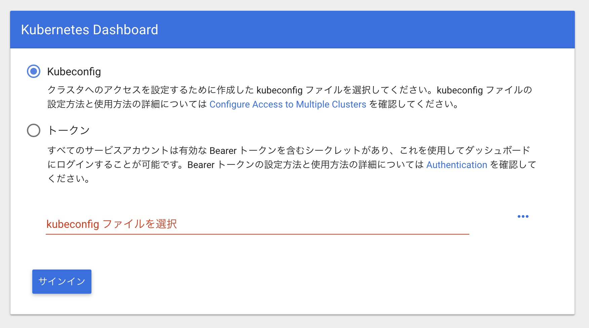
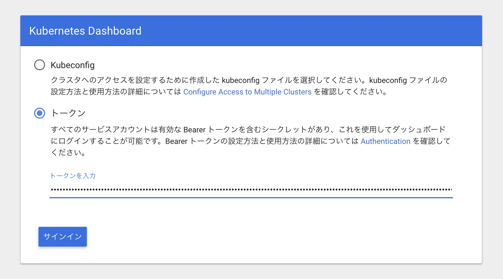
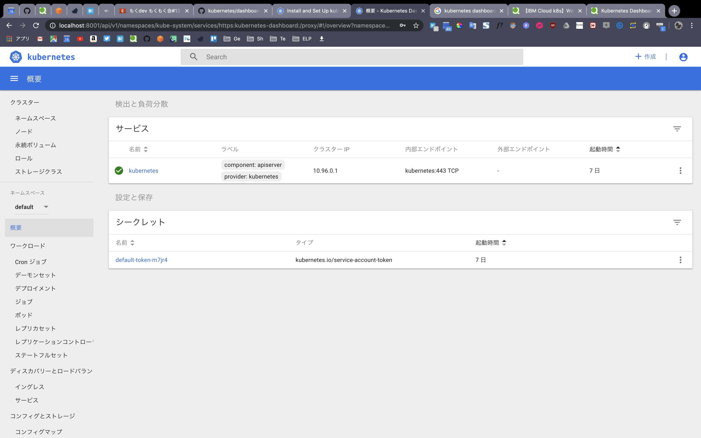
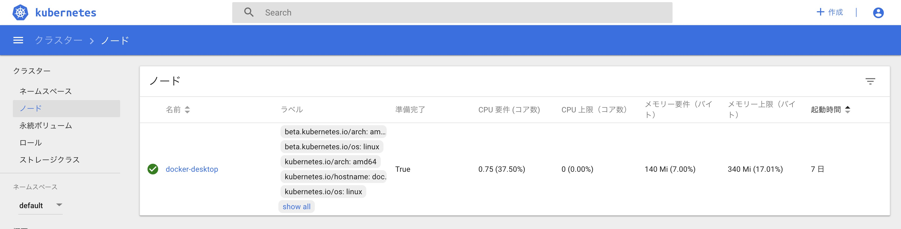

# 5 Kubernetes入門

## 5-1 Kubernetesとは

### 位置づけ

Dockerはコンテナを管理するためのdockerdという常駐プログラムとCLIからなる。Swarmは複数のホストを束ねて基本的なコンテナオーケストレーションを実現するためのDockerの関連技術の一部。KubernetesはSwarmより機能が充実したコンテナオーケストレーションシステムであり、Dockerを始めとする様々なコンテナランタイムを扱うことができる。

KubernetesはCompose/Stack/Swarmの機能を統合しつつ、より高度に管理できるものと考えればOK。

## 5-2 ローカル環境でKubernetesを実行する

### 5-2-1 Docker for MacでローカルKubernetes環境を構築する

GUIに従ってそのままインストール。設定画面に`Kubernetes is running`と表示されればOK。

コマンドラインツールのkubectlをインストールする。書籍にも記載があったが、最新の情報が欲しかったので以下を参考にする。

https://kubernetes.io/docs/tasks/tools/install-kubectl/#install-kubectl-on-macos

```bash
# Download the latest release with the command:
curl -LO https://storage.googleapis.com/kubernetes-release/release/$(curl -s https://storage.googleapis.com/kubernetes-release/release/stable.txt)/bin/darwin/amd64/kubectl

# Make the kubectl binary executable.
chmod +x ./kubectl

# Move the binary in to your PATH.
sudo mv ./kubectl /usr/local/bin/kubectl

# Test to ensure the version you installed is up-to-date:
kubectl version

Client Version: version.Info{Major:"1", Minor:"15", GitVersion:"v1.15.2", GitCommit:"f6278300bebbb750328ac16ee6dd3aa7d3549568", GitTreeState:"clean", BuildDate:"2019-08-05T09:23:26Z", GoVersion:"go1.12.5", Compiler:"gc", Platform:"darwin/amd64"}
Server Version: version.Info{Major:"1", Minor:"14", GitVersion:"v1.14.3", GitCommit:"5e53fd6bc17c0dec8434817e69b04a25d8ae0ff0", GitTreeState:"clean", BuildDate:"2019-06-06T01:36:19Z", GoVersion:"go1.12.5", Compiler:"gc", Platform:"linux/amd64"}
```

下にHomebrewのインストールがあったのを後から見つけた…

試しにダッシュボードをインストールする。手順は以下:

https://github.com/kubernetes/dashboard

```bash
# To deploy Dashboard, execute following command:
kubectl apply -f https://raw.githubusercontent.com/kubernetes/dashboard/v1.10.1/src/deploy/recommended/kubernetes-dashboard.yaml

secret/kubernetes-dashboard-certs created
serviceaccount/kubernetes-dashboard created
role.rbac.authorization.k8s.io/kubernetes-dashboard-minimal created
rolebinding.rbac.authorization.k8s.io/kubernetes-dashboard-minimal created
deployment.apps/kubernetes-dashboard created
service/kubernetes-dashboard created

# デプロイ状況を確認する。"STATUS=Running"になっていればデプロイ完了
kubectl get pod --namespace=kube-system -l k8s-app=kubernetes-dashboard

NAME                                    READY   STATUS    RESTARTS   AGE
kubernetes-dashboard-5f7b999d65-q7wxm   1/1     Running   0          2m26s

# ダッシュボードをブラウザで閲覧するため、プロキシサーバーを立ち上げる
kubectl proxy

Starting to serve on 127.0.0.1:8001
```

以下のURLにアクセスしてダッシュボードを表示する。

http://localhost:8001/api/v1/namespaces/kube-system/services/https:kubernetes-dashboard:/proxy

謎の認証画面が出た…本にないやつだ…



以下を参考にして管理者権限で閲覧できるようにする。

[Kubernetes Dashboardにcluster-admin権限でSign inする - Qiita](https://qiita.com/h-sakano/items/79bb15f7a0661e141c75)

`./src/5/service-account.yaml`を作成し、以下のように記述

```yaml
apiVersion: v1
kind: ServiceAccount
metadata:
  name: admin-user
  namespace: kube-system
---
apiVersion: rbac.authorization.k8s.io/v1beta1
kind: ClusterRoleBinding
metadata:
  name: admin-user
roleRef:
  apiGroup: rbac.authorization.k8s.io
  kind: ClusterRole
  name: cluster-admin
subjects:
- kind: ServiceAccount
  name: admin-user
  namespace: kube-system
```

以下のコマンドでデプロイする。

```bash
kubectl apply -f service-account.yaml

serviceaccount/admin-user created
clusterrolebinding.rbac.authorization.k8s.io/admin-user created
```

以下のコマンドの結果から、`admin-user-token-xxxxx`が出現することを確認する。

```bash
kubectl -n kube-system get secret | grep admin-user-token-

admin-user-token-d6dsr                           kubernetes.io/service-account-token   3      3m48s
```

あとはこのTokenを取得する。

```bash
kubectl -n kube-system describe secret admin-user-token-d6dsr

# tokenフィールドの値をコピーする。
```

ダッシュボード画面を再度開き、コピーしたトークンを貼り付けるとログインできる。





## 5-3 Kubernetesの概念

Kubernetesで実行されるアプリケーションは様々なリソースと協調して動作することで成立する。

## 5-4 KubernetesクラスタとNode

クラスタはKubernetesの様々なリソースを管理する集合体のことを指す。クラスタが持つリソースで最も大きな概念がNode（ノード）。Nodeはクラスタの管理下に登録されているDockerホストのことで、Kubernetesでコンテナをデプロイするために利用される。また、全体を管理するサーバであるMasterノードが少なくとも1つは配置されており、Kubernetesクラスタは、MasterとNode群によって構成される。

クラスタに配置されているNodeの数、Nodeのマシンスペックによって配置できるコンテナの数は変わってくる。Nodeによってクラスタのキャパシティを調整する。

```bash
# Nodeの一覧を取得する
kubectl get nodes

NAME             STATUS   ROLES    AGE     VERSION
docker-desktop   Ready    master   7d20h   v1.14.3
```

NodeはDashboardでも確認できる。



クラウドで動作させている場合は、GCPにおけるGCE、AWSにおけるEC2のインスタンスがNodeとなる。

## 5-5 Namespace

Namespaceは、クラスタの中に入れ子となる仮想的なクラスタのこと。クラスタを構築するとあらかじめ以下のNamespaceが用意されている。

```bash
# Namespace一覧を取得する
kubectl get namespaces

NAME              STATUS   AGE
default           Active   7d20h
docker            Active   7d20h
kube-node-lease   Active   7d20h
kube-public       Active   7d20h
kube-system       Active   7d20h
```

開発者それぞれのNamespaceを用意することでメインのNamespaceが散らかるのを防いだり、Namespaceごとに操作権限を設定して制御することができる。

## 5-6 Pod

Podはコンテナの集合体の単位。1つ以上のコンテナを持つ。KubernetesをDockerと組み合わせる場合、Podが持つのはDockerコンテナの単体または集合体となる。

KubernetesではPodという単位でコンテナを一括りにしてデプロイする。コンテナが1つの場合でもPodにしてデプロイする。

PodはどこかのNodeに配置される。同じPodを複数のNodeに配置したり、1つのNodeに複数配置することも可能。

同一Pod内のコンテナはすべて同一Nodeに配置される。1つのPod内のコンテナが複数Nodeにわたって配置されることはない。

Docker SwarmではmanagerノードがSwarmクラスタ全体を制御する役割を担っていたが、Kubernetesでは管理用サーバのMasterがその役割を担う。Masterノードは管理用のコンポーネントのPodだけがデプロイされたNodeである。

### 5-6-1 Podを作成してデプロイする

3章で用いた`nginx-proxy`と`echo`アプリケーションを利用し、この2つのコンテナだけで構成されるPodをローカルKubernetes環境にデプロイする。

設定ファイルについて:

- `kind`: Kubernetesのリソースの種類を指定する
- `metadata`: リソースに付与するメタデータで、`metadata.name`がリソースの名称として利用される
- `spec`: リソースを定義するための属性
- `containers`:
  - `name`: 各コンテナの名前
  - `image`: Docker Hubのイメージ保存先
  - `ports`: コンテナがEXPOSEするポートの指定
  - `env`: 環境変数の列挙

```bash
cd ./src/5
touch simple-pod.yaml
# 作成は省略

# 設定したPodをKubernetesクラスタに反映する（-fオプションでファイルを指定）
kubectl apply -f simple-pod.yaml

pod/simple-echo created
# この時点ではまだPodにアクセスできない
```

### 5-6-2 Podを操作する

Podの一覧を表示する。`Running`になっていれば全コンテナが実行状態になっている

```bash
kubectl get pod

NAME          READY   STATUS    RESTARTS   AGE
simple-echo   2/2     Running   0          96s
```

```bash
# コンテナ内のプログラム実行例
# -cオプションでコンテナを指定
kubectl exec -it simple-echo sh -c nginx

# コンテナの標準出力を表示
kubectl logs -f simple-echo -c echo
2019/08/18 06:17:44 start server

# Podの削除
kubectl delete pod simple-echo

pod "simple-echo" deleted
# 上が表示されてからしばらく時間がかかるので注意する

# マニフェストファイルベースでのPod削除
kubectl delete -f simple-pod.yaml
```

## 5-7 ReplicaSet

一定以上の規模のアプリケーションを構築していく上では、同一のPodを複数実行することで可用性を高めていくことが必要になる。このようなケースではReplicaSetを利用する。ReplicaSetは同じ仕様のPodを複数生成・管理するためのリソースであり、Podの内訳自体もReplicaSetのyamlファイルに記載する。

```bash
cd ./src/5
touch simple-replicaset.yaml
# 編集は省略

# デプロイ
kubectl apply -f simple-replicaset.yaml
# replicasに3を指定したので、同一のPodが3つ作られる
kubectl get pod

NAME         READY   STATUS    RESTARTS   AGE
echo-5nnw6   2/2     Running   0          60s
echo-f2kws   2/2     Running   0          60s
echo-s7ks9   2/2     Running   0          60s
```

- `replicas`: 作成するPod数

`template`属性の内容はPod定義と同じものになっている。作成したReplicaSetは、Podと同様にマニフェストファイルを指定して削除する。

## 5-8 Deployment

ReplicaSetより上位のリソースとして、Deploymentというリソースが提供されている。アプリケーションデプロイの基本単位となるリソース。

DeploymentはReplicaSetを管理・操作するために提供されている。

```bash
cd ./src/5
touch simple-deployment.yaml
# 編集は省略。ReplicaSetと世代管理以外の差はない

# --recordオプションによって実行したkubectlのコマンドを記録する
kubectl apply -f simple-deployment.yaml --record

# Deployment, ReplicaSet, Podが作成されていることを確認する
kubectl get pod,replicaset,deployment --selector app=echo

NAME                        READY   STATUS    RESTARTS   AGE
pod/echo-679f89b546-2kwzr   2/2     Running   0          66s
pod/echo-679f89b546-7xd4b   2/2     Running   0          66s
pod/echo-679f89b546-xzq6p   2/2     Running   0          66s

NAME                                    DESIRED   CURRENT   READY   AGE
replicaset.extensions/echo-679f89b546   3         3         3       66s

NAME                         READY   UP-TO-DATE   AVAILABLE   AGE
deployment.extensions/echo   3/3     3            3           66s

# Deploymentのリビジョンを確認する
kubectl rollout history deployment echo

# 初回の反映のため、リビジョンは1となっている。
deployment.extensions/echo
REVISION  CHANGE-CAUSE
1         kubectl apply --filename=simple-deployment.yaml --record=true
```

### 5-8-1 ReplicaSetライフサイクル

KubernetesではReplicaSetを直接用いることはなく、Deploymentのマニフェストファイルを扱う運用がほとんど。

- Pod数のみを更新しても新規ReplicaSetは生まれない
- Deploymentの内容に変更があった場合新しいリビジョンが作成される

### 5-8-2 ロールバックの実行

以下でロールバックを実行できる

```bash
kubectl rollout undo deployment echo
```

## 5-9 Service

Kubernetesクラスタ内において、Podの集合（主にReplicaSet）に対する経路やサービスディスカバリ（動的にAPIの接続先が変わる場合、クライアントからは一貫した名前でアクセスできる仕組み）を提供するためのリソース。Serviceのターゲットとなる一連のPodは、Serviceで定義するラベルセレクタによって決定される。

`simple-replicaset-with-label.yaml`というマニフェストファイルを作成し、ReplicaSetを2つ定義する。内容はすでに作成したechoのReplicaSetとほぼ同じだが、`release`というラベルがつけられれ、それぞれ`spring`と`summer`になっている。

```bash
cd ./src/5
touch simple-replicaset-with-label.yaml
# 編集は省略

kubectl apply -f simple-replicaset-with-label.yaml
replicaset.apps/echo-spring created
replicaset.apps/echo-summer created

# それぞれ作成されていることを確認
kubectl get pod -l app=echo -l release=spring
NAME                READY   STATUS    RESTARTS   AGE
echo-spring-qwl5s   2/2     Running   0          40s

kubectl get pod -l app=echo -l release=summer
NAME                READY   STATUS    RESTARTS   AGE
echo-summer-4dx28   2/2     Running   0          66s
echo-summer-whblm   2/2     Running   0          66s
```

次に、`release=summer`を持つPodだけにアクセスできるよなServiceを作成する。`spec.selector`属性にはServiceのターゲットとしたいPodが持つラベルを設定する。

PodのラベルがServiceにセレクタで定義しているラベルと合致した場合、対象のPodはそのServiceのターゲットとなり、Service経由してトラフィック（今回の場合はHTTPリクエスト）が流れるようになる。

```bash
touch simple-service.yaml
# 編集は省略

kubectl apply -f simple-service.yaml
service/echo created

kubectl get svc echo
NAME   TYPE        CLUSTER-IP      EXTERNAL-IP   PORT(S)   AGE
echo   ClusterIP   10.100.165.74   <none>        80/TCP    25s
```

実際にrelease=summerを持つPodだけにトラフィックが流れるか確認する。基本的にはServiceはKubernetesクラスタの中からしかアクセスできないので、Kubernetesクラスタ内に一時的なデバックコンテナをデプロイし、`curl`でHTTPリクエストを送って確認する。

```bash
kubectl run -i --rm --tty debug --image=gihyodocker/fundamental:0.1.0 --restart=Never -- bash -il
If you don't see a command prompt, try pressing enter.
debug:/# curl http://echo/
Hello Docker!!debug:/#
```

上記から導通が取れていることが分かる。下では、springのラベルを持つPodにはログが出力されていないことを、summerにはログがあることを確認する。

```bash
kubectl logs -f echo-spring-qwl5s -c echo
2019/08/18 07:19:27 start server

kubectl logs -f echo-summer-4dx28 -c echo
2019/08/18 07:19:32 start server
2019/08/18 07:34:19 received request
```

Kubernetesクラスタ内のアプリケーション同士を強調させるようなケースではService名で名前を解決でき、ターゲットのPodにリクエストを分散させることもできる。

### 5-9-1 ClusterIP Service

作成されるServiceには様々な種類があり、yaml内で定義できる。デフォルトがClusterIP Serviceとなる。

Kubernetesクラスタ上の内部IPアドレスにServiceを公開でき、これにより、あるPodから別のPod群へのアクセスはServiceを介して行うことができ、かつService名で名前解決できるようになる。ただし、外からはリーチできない。

### 5-9-2 NodePort Service

クラスタ外からアクセスできるService。ClusterIPを作る点では上と同じだが、各ノード上からServiceポートへ接続するためのグローバルなポートを開けるという違いがある。ローカルからのHTTPでのアクセスも可能になる。

### 5-9-3 LoadBalancer Service

ローカルKubernetes環境では利用できない。主に各クラウドプラットフォームで提供されているロードバランサーと連携するためのもの。

### 5-9-4 ExternalName Service

ExternalName Serviceはselectorもport定義も持たないかなり特殊なService。Kubernetesクラスタ内から外部のホストを解決するためのエイリアスを提供する。

## 5-10 Ingress

ServiceのKubernetesクラスタの外への航海と、VirtualHostやパスベースでの高度なHTTPルーティングを両立する。HTTP/HTTPSのサービス公開するユースケースでは、間違いなくIngressを利用する。

素の状態のローカルKubernetes環境ではIngressを使ったServiceの公開をすることはできないので、クラスタの外からのHTTPリクエストをServiceぬルーティングするための`nginx_ingress_controller`を次のページを参考にしつつデプロイする。

https://github.com/kubernetes/ingress-nginx/blob/nginx-0.25.1/docs/deploy/index.md

```bash
kubectl apply -f https://raw.githubusercontent.com/kubernetes/ingress-nginx/nginx-0.25.1/deploy/static/mandatory.yaml

namespace/ingress-nginx created
configmap/nginx-configuration created
configmap/tcp-services created
configmap/udp-services created
serviceaccount/nginx-ingress-serviceaccount created
clusterrole.rbac.authorization.k8s.io/nginx-ingress-clusterrole created
role.rbac.authorization.k8s.io/nginx-ingress-role created
rolebinding.rbac.authorization.k8s.io/nginx-ingress-role-nisa-binding created
clusterrolebinding.rbac.authorization.k8s.io/nginx-ingress-clusterrole-nisa-binding created
deployment.apps/nginx-ingress-controller created

kubectl apply -f https://raw.githubusercontent.com/kubernetes/ingress-nginx/nginx-0.25.1/deploy/static/provider/cloud-generic.yaml

service/ingress-nginx created
```

`ingress-nginx`というNamespace上に次のようなServiceとPodが作成される。Ingressリソースを利用する準備はこれで完了。

*TODO:書籍のとおりに2つずつServiceとPodが表示されない状態*

```bash
kubectl -n ingress-nginx get service,pod
NAME                    TYPE           CLUSTER-IP     EXTERNAL-IP   PORT(S)                      AGE
service/ingress-nginx   LoadBalancer   10.96.205.77   localhost     80:31183/TCP,443:30351/TCP   55s

NAME                                            READY   STATUS    RESTARTS   AGE
pod/nginx-ingress-controller-86449c74bb-c4n47   1/1     Running   0          108
```

### 5-10-1 Ingressを通じたアクセス